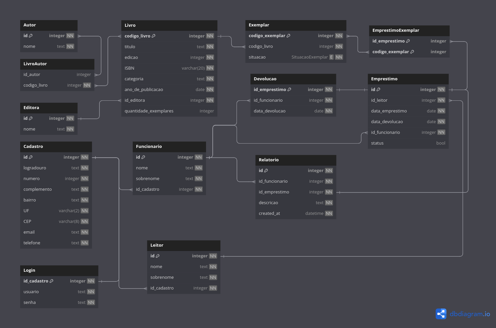

<!DOCTYPE html>
<html lang="en">
<head>
    <meta charset="UTF-8">
    <meta name="viewport" content="width=device-width, initial-scale=1.0">
    <title>Documentação</title>
    <style>
        .logo {
            position: absolute;
            top: 10px;
            right: 10px;
            width: 50px; /* Ajuste conforme necessário */
        }
    </style>
</head>
<body>
    
</body>
</html>

# N3 Banco de dados


Matheus Eduardo Pedrelli Mauricio

### Sistema Integrado de gestão bibliotecária

## Modelagem do banco




## Entidades e Relacionamentos

### Livro

A entidade `Livro` representa um livro na biblioteca. Cada livro tem informações como título, edição, ISBN, categoria, ano de publicação e quantidade de exemplares.

- **Campos:**
  - `id` (Integer): Identificador único do livro.
  - `titulo` (String): Título do livro.
  - `edicao` (Integer): Edição do livro.
  - `ISBN10` (String): Código ISBN-10 do livro.
  - `ISBN13` (String): Código ISBN-13 do livro.
  - `categoria` (String): Categoria do livro.
  - `ano_publicacao` (Integer): Ano de publicação do livro.
  - `quantidade_exemplares` (Integer): Quantidade de exemplares disponíveis.

- **Relacionamentos:**
  - `editora` (Foreign Key): Relacionamento com a entidade `Editora`.
  - `autores` (Many-to-Many): Relacionamento com a entidade `Autor`.
  - `exemplares` (One-to-Many): Relacionamento com a entidade `Exemplar`.

### Autor

A entidade `Autor` representa um autor de livros.

- **Campos:**
  - `id` (Integer): Identificador único do autor.
  - `nome` (String): Nome do autor.

- **Relacionamentos:**
  - `livros` (Many-to-Many): Relacionamento com a entidade `Livro`.

### Editora

A entidade `Editora` representa uma editora de livros.

- **Campos:**
  - `id` (Integer): Identificador único da editora.
  - `nome` (String): Nome da editora.

- **Relacionamentos:**
  - `livros` (One-to-Many): Relacionamento com a entidade `Livro`.

### Exemplar

A entidade `Exemplar` representa uma cópia física de um livro.

- **Campos:**
  - `id` (Integer): Identificador único do exemplar.
  - `livro_id` (Foreign Key): Relacionamento com a entidade `Livro`.
  - `situacao` (Enum): Situação do exemplar (disponível ou emprestado).

- **Relacionamentos:**
  - `livro` (Foreign Key): Relacionamento com a entidade `Livro`.
  - `emprestimo` (Many-to-Many): Relacionamento com a entidade `Emprestimo`.

### Emprestimo

A entidade `Emprestimo` representa um empréstimo de exemplares.

- **Campos:**
  - `id` (Integer): Identificador único do empréstimo.
  - `user_id` (Foreign Key): Relacionamento com a entidade `User`.
  - `data_devolucao` (DateTime): Data de devolução do empréstimo.
  - `funcionario_id` (Foreign Key): Relacionamento com a entidade `Funcionario`.
  - `status` (Boolean): Status do empréstimo (ativo ou finalizado).

- **Relacionamentos:**
  - `usuario` (Foreign Key): Relacionamento com a entidade `User`.
  - `funcionario` (Foreign Key): Relacionamento com a entidade `Funcionario`.
  - `exemplares` (Many-to-Many): Relacionamento com a entidade `Exemplar`.

### Devolucao

A entidade `Devolucao` representa a devolução de exemplares emprestados.

- **Campos:**
  - `id` (Integer): Identificador único da devolução.
  - `emprestimo_id` (Foreign Key): Relacionamento com a entidade `Emprestimo`.
  - `funcionario_id` (Foreign Key): Relacionamento com a entidade `Funcionario`.

- **Relacionamentos:**
  - `emprestimo` (Foreign Key): Relacionamento com a entidade `Emprestimo`.

### User

A entidade `User` representa um usuário da biblioteca.

- **Campos:**
  - `id` (Integer): Identificador único do usuário.
  - `nome` (String): Nome do usuário.
  - `sobrenome` (String): Sobrenome do usuário.
  - `cadastro_id` (Foreign Key): Relacionamento com a entidade `Cadastro`.

- **Relacionamentos:**
  - `cadastro` (Foreign Key): Relacionamento com a entidade `Cadastro`.

### Funcionario

A entidade `Funcionario` representa um funcionário da biblioteca.

- **Campos:**
  - `id` (Integer): Identificador único do funcionário.
  - `nome` (String): Nome do funcionário.
  - `sobrenome` (String): Sobrenome do funcionário.
  - `cadastro_id` (Foreign Key): Relacionamento com a entidade `Cadastro`.

- **Relacionamentos:**
  - `cadastro` (Foreign Key): Relacionamento com a entidade `Cadastro`.

### Cadastro

A entidade `Cadastro` representa as informações de cadastro de usuários e funcionários.

- **Campos:**
  - `id` (Integer): Identificador único do cadastro.
  - `logradouro` (String): Logradouro do endereço.
  - `numero` (Integer): Número do endereço.
  - `complemento` (String): Complemento do endereço.
  - `bairro` (String): Bairro do endereço.
  - `UF` (String): Unidade Federativa (estado).
  - `email` (String): Email de contato.
  - `telefone` (String): Telefone de contato.

- **Relacionamentos:**
  - `usuarios` (One-to-Many): Relacionamento com a entidade `User`.
  - `funcionarios` (One-to-Many): Relacionamento com a entidade `Funcionario`.

### Relacionamentos entre as Entidades

- **Livro - Autor:** Muitos-para-muitos através da tabela associativa `livro_autor`.
- **Livro - Exemplar:** Um-para-muitos, um livro pode ter vários exemplares.
- **Livro - Editora:** Muitos-para-um, vários livros podem ser publicados pela mesma editora.
- **Exemplar - Emprestimo:** Muitos-para-muitos através da tabela associativa `emprestimo_exemplar`.
- **Emprestimo - User:** Muitos-para-um, vários empréstimos podem ser feitos por um usuário.
- **Emprestimo - Funcionario:** Muitos-para-um, vários empréstimos podem ser registrados por um funcionário.
- **Devolucao - Emprestimo:** Um-para-um, cada devolução está associada a um empréstimo.
- **User - Cadastro:** um-para-um, um usuário só pode possuir um cadastro
- **Funcionario - Cadastro:** um-para-um, um funcionário só pode possuir um cadastro

## Triggers e Procedures

- Incrementa quantidade de exemplares ao cadastrar exemplar:

```sql
CREATE TRIGGER incrementar_quantidade_exemplares
    AFTER INSERT ON exemplares
    FOR EACH ROW
    BEGIN
        UPDATE livro
        SET quantidade_exemplares = quantidade_exemplares + 1
        WHERE id = NEW.livro_id;
    END;
```

- Decrementa quantidade de exemplares ao deletar exemplar:

```sql
CREATE TRIGGER decrementar_quantidade_exemplares
    AFTER DELETE ON exemplares
    FOR EACH ROW
    BEGIN
        UPDATE livro
        SET quantidade_exemplares = quantidade_exemplares - 1
        WHERE id = OLD.livro_id;
    END;
```

### Mudanças N2 para N3

Houve uma única mudança de N2 para a N3 que foi a inclusão de um valor booleano para definir o status do empréstimo. Dessa forma, quando estiver em `true`o emprestimo está em aberto, e `false`o empréstimo está encerrado. 

Essa mudança possibilita que não seja feito uma busca dos emprestimos que estão na tabela de `Emprestimo` porém não estão na tabela de `Devolucao`.

### Caracteristicas de segurança

O banco de dados não possui nenhum tipo de controle de acesso, qualquer requisição, de qualquer lugar permite modificar os  dados. O app apenas executa rollback no banco em caso de excessões. 

## Tabelas Principais: Livro e Emprestimo

### Tabela: Livro

#### Funcionalidade

A tabela `Livro` é uma das tabelas principais do sistema de gerenciamento de biblioteca. Ela armazena informações detalhadas sobre cada livro disponível na biblioteca. Essa tabela é crucial porque centraliza dados essenciais dos livros, permitindo que os usuários e funcionários saibam quais livros estão disponíveis, suas edições, categorias, e informações de identificação como ISBN.

#### Campos e Chaves

- **id (Integer, Primary Key):**
  - **Importância:** Garantir que cada registro na tabela `Livro` seja único e possa ser referenciado de maneira inequívoca por outras tabelas.

- **titulo (String):**
  - **Importância:** Facilita a identificação e busca dos livros na biblioteca.

- **edicao (Integer):**
  - **Importância:** Permite diferenciar entre diferentes edições do mesmo título.

- **ISBN10 (String) e ISBN13 (String):**
  - **Importância:** Esses códigos são identificadores únicos usados internacionalmente para identificar livros.

- **categoria (String):**
  - **Importância:** Facilita a organização e busca dos livros por gênero.

- **ano_publicacao (Integer):**
  - **Importância:** Ajuda a identificar a data de lançamento e a versão do livro.

- **quantidade_exemplares (Integer):**
  - **Importância:** Indica quantas cópias físicas do livro estão disponíveis para empréstimo.

- **editora_id (Integer, Foreign Key):**
  - **Importância:** Permite acessar informações detalhadas sobre a editora do livro.
  - **Relacionamento:** Muitos-para-um com a tabela `Editora`.

- **autores (Many-to-Many Relationship):**
  - **Importância:** Permite armazenar informações sobre os autores que contribuíram para o livro.
  - **Relacionamento:** Muitos-para-muitos com a tabela `Autor` através da tabela associativa `livro_autor`.

### Tabela: Emprestimo

#### Funcionalidade

A tabela `Emprestimo` é outra tabela principal do sistema, responsável por registrar todos os empréstimos de exemplares na biblioteca. Ela rastreia quais livros foram emprestados, por quem, quando devem ser devolvidos, e o status do empréstimo. Isso é essencial para gerenciar a circulação dos livros e garantir que os usuários devolvam os livros dentro do prazo.

#### Campos e Chaves

- **id (Integer, Primary Key):**
  - **Importância:** Garantir que cada registro na tabela `Emprestimo` seja único e possa ser referenciado de maneira inequívoca por outras tabelas.

- **user_id (Integer, Foreign Key):**
  - **Importância:** Permite rastrear qual usuário está com o livro.
  - **Relacionamento:** Muitos-para-um com a tabela `User`.

- **data_devolucao (DateTime):**
  - **Importância:** Ajuda a monitorar e gerenciar a devolução dos livros, garantindo que os usuários devolvam os livros no prazo.

- **funcionario_id (Integer, Foreign Key):**
  - **Importância:** Permite rastrear qual funcionário processou o empréstimo.
  - **Relacionamento:** Muitos-para-um com a tabela `Funcionario`.

- **status (Boolean):**
  - **Importância:** Permite saber se o empréstimo ainda está em andamento ou se já foi concluído.

- **exemplares (Many-to-Many Relationship):**
  - **Importância:** Permite rastrear quais exemplares específicos foram emprestados em cada transação.
  - **Relacionamento:** Muitos-para-muitos com a tabela `Exemplar` através da tabela associativa `emprestimo_exemplar`.


